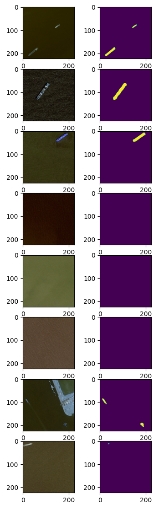

# Airbus Ship Detection Challenge

## EDA
EDA code is located in EDA.ipynb

During EDA I explored the distribution of images with and without ships. The data is imbalanced as 78% of all images does not contain any ships. This can badly affect traning of a model. In order to make data more balanced, I decided to take only 10% of no-ship images to the training set. (The quality of the model is improved and training time has reduced significantly)

Also I have explored the distribution of colors on images with and without ships. This was not as helpful because ships on images often take much less space than background. However, the colors of ships are generally different from background, which makes them well-distinguishable.

## Data

All data-related code located in utils\data.py.

I decided to create one DataGenerator for training and testing data. The type of data which is yield from the DataGenerator is determined by the "train" parameter: DataGenerator(... ,train = True/False).

The preprocessing of images is the same as for ImageNet dataset.

## Model 

Model-building-related code is located in unet\model_build.py

For this task, the U-Net architecture is used. I have combined a pretrained ResNet50 encoder and a custom decoder.

## Training
train.py

During model training, we use the Adam optimizer with a Polynomial learning rate scheduler. We utilize the DiceBCELoss as our loss function and evaluate performance using IoU alogside prefered DiceScore metrics. The model undergoes training for 15 epochs.

The training have been done in kaggle notebook with GPU P100 accelerator. Each epoch has taken ~15min (train + eval)

unet\custom_unet_weights.h5 - saved model weights

## Evaluation
eval.py

When we removed 90% of all no-ship images from out dataset, we greatly changed the nature of our data. To make sure our model performs well on the original distribution of images, we perform an additional evaluation on the data with the original balance of images.

## Results

In the end we achieved the folowing resuls:

On a validation set:
Epoch 15/15
2877/2877 [==============================] - 783s 272ms/step - loss: 0.1669 - IoU: 0.7310 - DiceScore: 0.8411 - **val_loss: 0.1785** - **val_IoU: 0.7154** - **val_DiceScore: 0.8300**

On a set we mentioned in "evaluation" part:
2407/2407 [==============================] - 502s 207ms/step - **loss: 0.2720** - **IoU: 0.6203** - **DiceScore: 0.7383**

Although here we optained sligtly worse results, balancing the training data helped the model to train to "capute" ships. 

## Inference
inference.py

In oder to make an inference, you need to specify an input_folder with images and output folder. Also it is possible to store masks as images with -sm argument:
python inference.py -i input_folder -o ouput_folder -sm

The default values: -i: "input_folder", -o: "ouput_folder"

## Visualize Results

